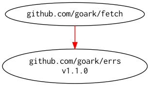

# [fetch] -- Fetch Data from URL

[](https://github.com/spiegel-im-spiegel/fetch/actions)
[](https://github.com/spiegel-im-spiegel/fetch/actions)
[](https://raw.githubusercontent.com/spiegel-im-spiegel/fetch/master/LICENSE)
[](https://github.com/spiegel-im-spiegel/fetch/releases/latest)

## Import

```go
import "github.com/spiegel-im-spiegel/fetch"
```

## Usage

```go
package main

import (
    "context"
    "fmt"
    "io"
    "net/http"
    "os"

    "github.com/spiegel-im-spiegel/fetch"
)

func main() {
    u, err := fetch.URL("https://github.com/spiegel-im-spiegel.gpg")
    if err != nil {
        fmt.Fprintln(os.Stderr, err)
        return
    }
    resp, err := fetch.New(
        fetch.WithHTTPClient(&http.Client{}),
    ).Get(
        u,
        fetch.WithContext(context.Background()),
    )
    if err != nil {
        fmt.Fprintln(os.Stderr, err)
        return
    }
    defer resp.Close()
    if _, err := io.Copy(os.Stdout, resp.Body()); err != nil {
        fmt.Fprintln(os.Stderr, err)
    }
}
```

## Modules Requirement Graph

[](./dependency.png)

[fetch]: https://github.com/spiegel-im-spiegel/fetch "spiegel-im-spiegel/fetch: Fetch Data from URL"
