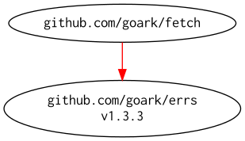

# Fetch Data from URL

[](https://github.com/goark/fetch/actions)
[](https://github.com/goark/fetch/actions)
[](https://pkg.go.dev/github.com/goark/fetch)
[](https://raw.githubusercontent.com/goark/fetch/main/LICENSE)
[](https://github.com/goark/fetch/releases/latest)

`fetch` is a focused helper package for downloading data from URL endpoints.
It wraps common `net/http` idioms so callers can handle download flows with less boilerplate and safer defaults.

## Design goals

- Keep application code simple for one-shot data fetching.
- Hide repetitive `net/http` handling patterns.
- Keep API surface small and composable.
- Use `context.Context` based operations as the default style.

## Development

### Requirements

- Go 1.25 or later
- [Task](https://taskfile.dev/) command (local tool for this repository)

### Local validation

```text
task test
task govulncheck
```

Run all maintenance tasks:

```text
task
```

## CI Workflows

- `ci`: lint (`golangci-lint` with `gosec`), tests, and `govulncheck`
- `CodeQL`: scheduled and push/PR static analysis

## Usage

### Install and import

```bash
go get github.com/goark/fetch@latest
```

```go
import "github.com/goark/fetch"
```

### Sample programs

All sample files under `sample/` use the `run` build tag.

```text
go run -tags run ./sample/sample.go
```

- Basic GET download: [sample/sample.go](sample/sample.go)

### GET request

```go
package main

import (
  "context"
  "fmt"
  "io"
  "os"

  "github.com/goark/fetch"
)

func main() {
  u, err := fetch.URL("https://github.com/spiegel-im-spiegel.gpg")
  if err != nil {
    fmt.Fprintln(os.Stderr, err)
    return
  }

  resp, err := fetch.New().GetWithContext(context.Background(), u)
  if err != nil {
    fmt.Fprintln(os.Stderr, err)
    return
  }
  defer resp.Close()

  if _, err := io.Copy(os.Stdout, resp.Body()); err != nil {
    fmt.Fprintln(os.Stderr, err)
  }
}
```

### POST request

```go
payload := strings.NewReader("name=alice")
resp, err := fetch.New().PostWithContext(ctx, u, payload,
  fetch.WithRequestHeaderSet("Content-Type", "application/x-www-form-urlencoded"),
)
if err != nil {
  return err
}
defer resp.Close()
```

### Public API

- `fetch.URL(raw string)` parses and validates URL input.
- `fetch.New(opts ...fetch.ClientOpts)` creates a fetch client.
- `Client.GetWithContext(ctx, u, opts...)` performs GET request.
- `Client.PostWithContext(ctx, u, payload, opts...)` performs POST request.
- `fetch.WithHTTPClient(cli)` injects custom `*http.Client`.
- `fetch.WithRequestHeaderAdd(name, value)` and `fetch.WithRequestHeaderSet(name, value)` apply request headers.

### Error handling

The package wraps errors, so use `errors.Is` for checks against:

- `fetch.ErrInvalidURL`
- `fetch.ErrInvalidRequest`
- `fetch.ErrHTTPStatus`

```go
if err != nil {
  switch {
  case errors.Is(err, fetch.ErrInvalidURL):
    // invalid URL input
  case errors.Is(err, fetch.ErrHTTPStatus):
    // non-success HTTP status (>= 400)
  }
}
```

### Response lifecycle

Always close the response:

- `defer resp.Close()` for streaming use.
- Use `resp.DumpBodyAndClose()` when you need body bytes at once.

### Modules Requirement Graph

[](./dependency.png)
